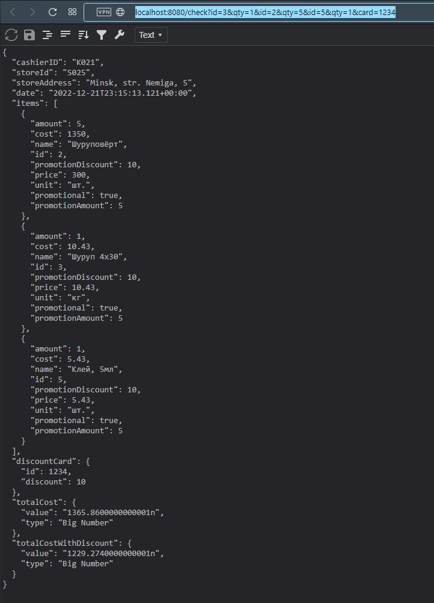
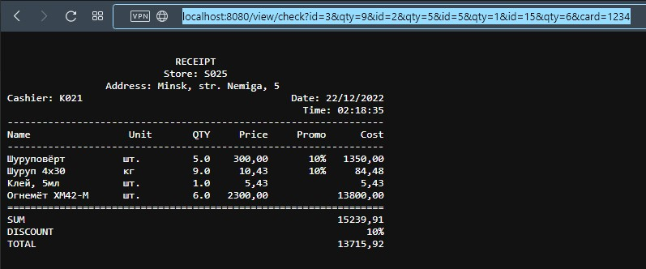
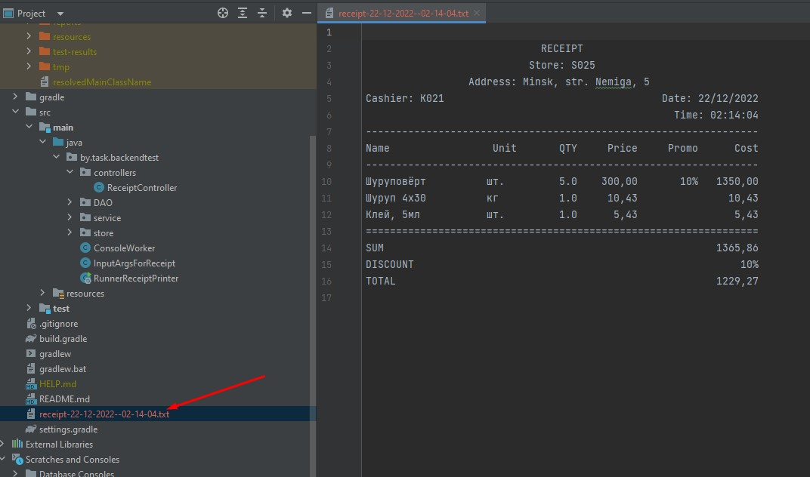

# backendTest
___
## Используемый стек
__Java 17, SpringBoot 3.0.0, JDBCTemplate, Gradle 7.5, PostgreSQL__
___
## Запуск
Скопировать файл __RunnerReceiptPrinter.jar__ из директории, приведённой ниже, в удобную вам директорию:

    src/main/resources/jar/RunnerReceiptPrinter.jar

Запускать командой:

    java -jar path/to/RunnerReceiptPrinter.jar 3-1 2-5 5-1 card-1234

Есть 2 эндпоинта:

    http://localhost:8080/check
    http://localhost:8080/view/check

Примеры ссылок:

    http://localhost:8080/check?id=3&qty=1&id=2&qty=5&id=5&qty=1&card=1234
    http://localhost:8080/view/check?id=3&qty=1&id=2&qty=5&id=5&qty=1&id=15&qty=6&card=1234

___
## Скриншоты работы

