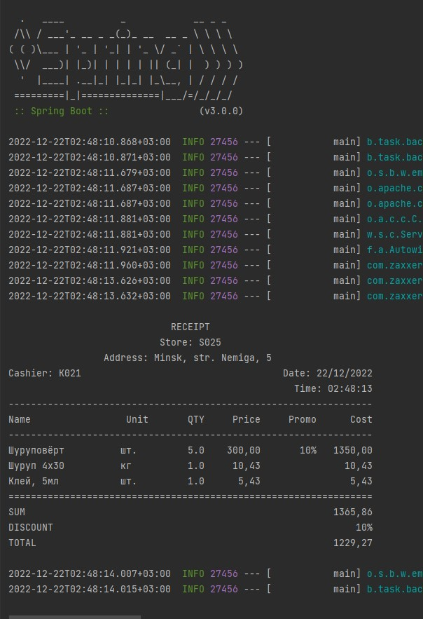

# backendTest
___

[Ссылка на задание Reflection](https://github.com/VladislavSkrupski/clevertec-backend-entrence-task-remaster/tree/develop/src/main/java/ru/clevertec/backendtest/service/util)
___
## Используемый стек
__Java 17, SpringBoot 3.0.0, JDBCTemplate, Gradle 7.5, PostgreSQL__
___
## Запуск
Скопировать файл __RunnerReceiptPrinter.jar__ из директории, приведённой ниже, в удобную вам директорию:

    src/main/resources/jar/RunnerReceiptPrinter.jar

Запускать командой:

    java -jar path/to/RunnerReceiptPrinter.jar 3-1 2-5 5-1 card-1234

Endpoints:

    GET http://localhost:8080/check
    PUT http://localhost:8080/discountcard
    POST http://localhost:8080/discountcard
    GET http://localhost:8080/discountcard/xml/{{id}}
    GET http://localhost:8080/discountcard/{{id}}
    DELETE http://localhost:8080/discountcard/{{id}}
    
    PUT http://localhost:8080/product
    POST http://localhost:8080/product
    GET http://localhost:8080/product/all
    GET http://localhost:8080/product/ids
    GET http://localhost:8080/product/xml/all
    GET http://localhost:8080/product/xml/ids
    GET http://localhost:8080/product/xml/{{id}}
    GET http://localhost:8080/product/{{id}}
    DELETE http://localhost:8080/product/{{id}}
    
    GET http://localhost:8080/check/
    GET http://localhost:8080/check/pdf
    GET http://localhost:8080/check/view

Примеры ссылок:

    http://localhost:8080/check?id=3&qty=1&id=2&qty=5&id=5&qty=1&card=1234
    http://localhost:8080/check/view?id=3&qty=1&id=2&qty=5&id=5&qty=1&id=15&qty=6&card=1234

___
## Скриншоты работы

